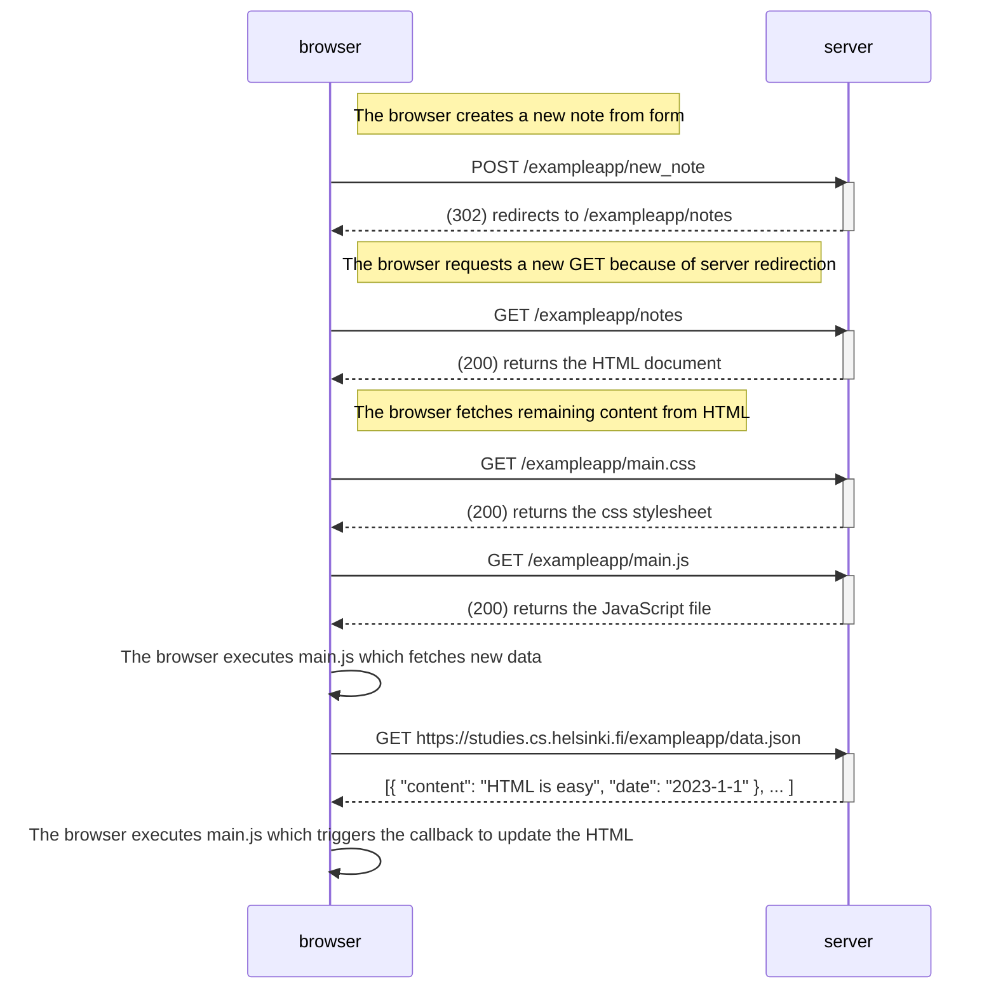

```mermaid
sequenceDiagram
    participant browser
    participant server
    
    Note right of browser: The browser creates a new note from form
    
    browser->>server: POST /exampleapp/new_note
    activate server
    server-->>browser: (302) redirects to /exampleapp/notes
    deactivate server
    
    Note right of browser: The browser requests a new GET because of server redirection
    
    browser->>server: GET /exampleapp/notes
    activate server
    server-->>browser: (200) returns the HTML document
    deactivate server
    
    Note right of browser: The browser fetches remaining content from HTML
    
    browser->>server: GET /exampleapp/main.css
    activate server
    server-->>browser: (200) returns the css stylesheet
    deactivate server
    
    browser->>server: GET /exampleapp/main.js
    activate server
    server-->>browser: (200) returns the JavaScript file
    deactivate server

    browser->>browser: The browser executes main.js which fetches new data

    browser->>server: GET https://studies.cs.helsinki.fi/exampleapp/data.json
    activate server
    server-->>browser: [{ "content": "HTML is easy", "date": "2023-1-1" }, ... ]
    deactivate server

    browser->>browser: The browser executes main.js which triggers the callback to update the HTML
```