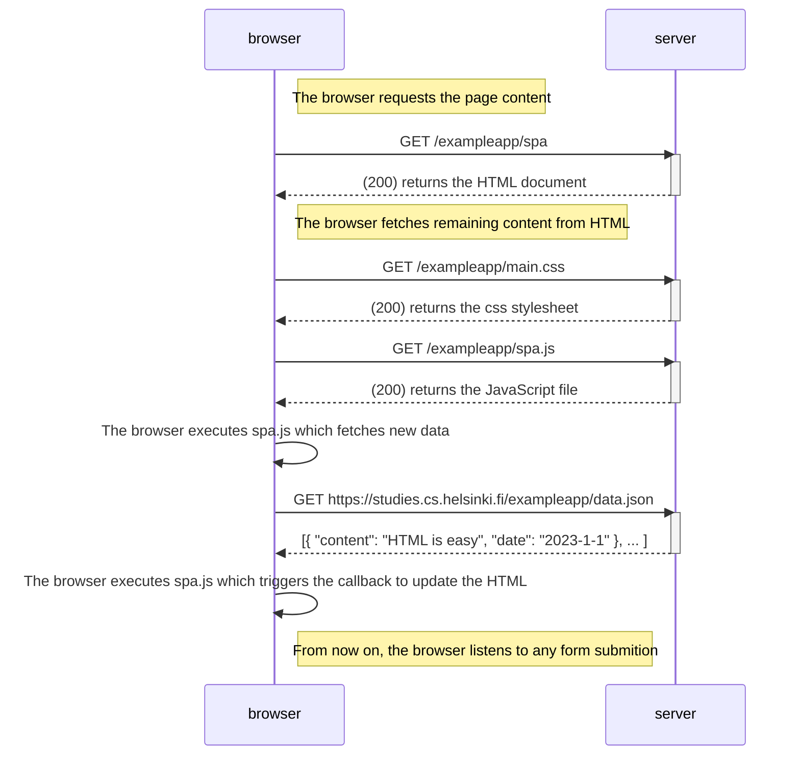

```mermaid
sequenceDiagram
    participant browser
    participant server

    Note right of browser: The browser requests the page content
    
    browser->>server: GET /exampleapp/spa
    activate server
    server-->>browser: (200) returns the HTML document
    deactivate server
    
    Note right of browser: The browser fetches remaining content from HTML
    
    browser->>server: GET /exampleapp/main.css
    activate server
    server-->>browser: (200) returns the css stylesheet
    deactivate server
    
    browser->>server: GET /exampleapp/spa.js
    activate server
    server-->>browser: (200) returns the JavaScript file
    deactivate server

    browser->>browser: The browser executes spa.js which fetches new data

    browser->>server: GET https://studies.cs.helsinki.fi/exampleapp/data.json
    activate server
    server-->>browser: [{ "content": "HTML is easy", "date": "2023-1-1" }, ... ]
    deactivate server

    browser->>browser: The browser executes spa.js which triggers the callback to update the HTML
    
    Note right of browser: From now on, the browser listens to any form submition
```